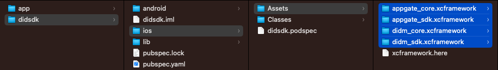
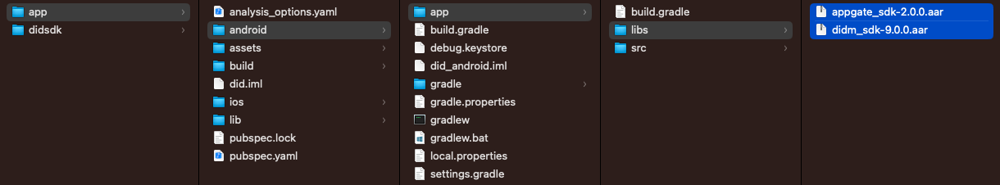
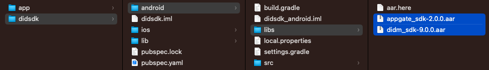
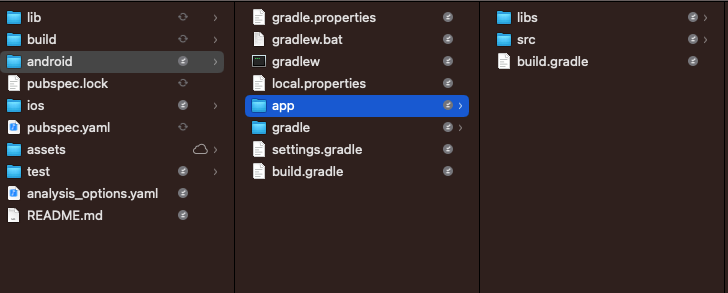
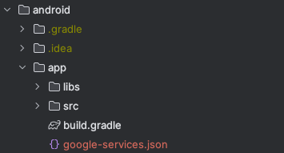
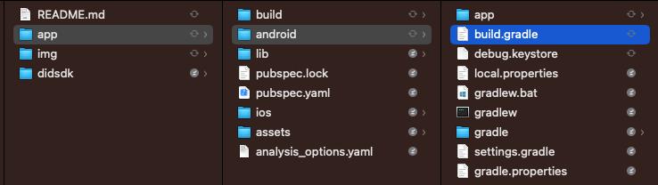
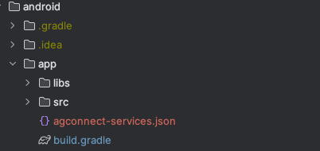

<picture style="display:block;float:none;margin-left:auto;margin-right:auto;width:60%">
    <source media="(prefers-color-scheme: dark)" srcset="./img/LogoDarkBackground.png">
    <source media="(prefers-color-scheme: light)" srcset="./img/LogoWhiteBackground.png" >
    
</picture>

# DetectID-SDK: Flutter Integration

## Table Of Contents

* [Disclaimer](#disclaimer)
* [Technical Information](#tech-desc)
* [Description](#description)
* [DID-SDK Integration](#did-sdk-integration)
  * [Preliminary Steps](#preliminary-steps)
* [Set-up the library](#set-up-the-library)
  * [iOS](#ios)
    * [Install Cocoapods](#install-cocoapods)
    * [Add permission for the camera](#add-permission-for-the-camera)
    * [Troubleshooting](#troubleshooting-ios)
  * [Android](#android)
    * [Copy aar to folders](#copy-aar-to-folders)
    * [Modify build.gradle](#modify-buildgradle)
    * [Troubleshooting](#troubleshooting-android)
* [Implementing the DID package](#implementing-the-did-package)
* [Implementation](#implementation)
  * [Registration with URL](#registration-with-url)
      * [Parameters](#parameters)
      * [Response](#response)
      * [Errors Table](#errors-table)
      * [Example](#example)
  * [Registration with QR](#registration-with-qr)
      * [Parameters](#parameters-1)
      * [Response](#response-1)
      * [Errors Table](#errors-table-1)
      * [Example](#example-1)
  * [Account management](#account-management)
    * [Get Accounts](#get-accounts)
      * [Response](#response-2)
      * [Example](#example-2)
    * [Set Account Username](#set-account-username)
      * [Parameters](#parameters-2)
      * [Example](#example-3)
    * [Remove Account](#remove-account)
      * [Parameters](#parameters-3)
      * [Example](#example-4)
  * [Common methods](#common-methods)
    * [Update Global config](#update-global-config)
      * [Parameters](#parameters-4)
      * [Example](#example-5)
    * [Set Application name](#set-application-name)
      * [Parameters](#parameters-5)
      * [Example](#example-6)
  * [Identifiers](#identifiers)
    * [Mobile ID](#mobile-id)
      * [Response](#response-3)
      * [Example](#example-7)
    * [Masked App Instance ID](#masked-app-instance-id)
      * [Response](#response-4)
      * [Example](#example-8)
  * [QR Authentication](#qr-authentication)
    * [QR Authentication Process](#qr-authentication-process)
      * [Parameters](#parameters-6)
      * [Response](#response-5)
      * [Errors Table](#errors-table-2)
      * [Example](#example-9)
    * [Confirm or Decline QR Code Transaction Actions](#confirm-or-decline-qr-code-transaction-actions)
      * [Parameters](#parameters-7)
      * [Response](#response-6)
      * [Errors Table](#errors-table-3)
      * [Example](#example-10)
  * [OTP - One Time Password](#otp---one-time-password)
    * [Time-based OTP](#time-based-otp)
      * [Parameters](#parameters-8)
      * [Response](#response-7)
      * [Example](#example-11)
    * [Challenge OTP](#challenge-otp)
      * [Parameters](#parameters-9)
      * [Response](#response-8)
      * [Errors Table](#errors-table-4)
      * [Example](#example-12)
  * [Push Notification Services](#push-notification-services)
      * [Initial Setup](#initial-setup)
      * [For iOS](#for-ios)
      * [For Android](#for-android)
        * [Configure with Firebase](#configure-with-firebase)
        * [Configure with Huawei](#configure-with-huawei)
        * [Configure Flutter](#configure-flutter)
      * [Request permissions](#request-permissions)
    * [Push Authentication](#push-authentication)
      * [Set Push Transaction Open Listener](#set-push-transaction-open-listener)
      * [Response](#response-9)
      * [Errors Table](#errors-table-5)
      * [Example](#example-13)
      * [Confirm or Decline Push Transaction Action](#confirm-or-decline-push-transaction-action)
      * [Parameters](#parameters-10)
      * [Response](#response-10)
      * [Errors Table](#errors-table-6)
      * [Example](#example-14)
    * [Push Alerts](#push-alerts)
      * [Set Push Alert Open Listener](#set-push-alert-open-listener)
      * [Response](#response-11)
      * [Errors Table](#errors-table-7)
      * [Example](#example-15)
      * [Approve Push Alert Action](#approve-push-alert-action)
      * [Parameters](#parameters-11)
      * [Response](#response-12)
      * [Example](#example-16)
  * [Push Notification with Multiple Providers](#push-notification-with-multiple-providers)
    * [iOS](#ios-1)


# Disclaimer

MIT License

Copyright (c) 2023 Appgate Cybersecurity, Inc.

Permission is hereby granted, free of charge, to any person obtaining a copy
of this software and associated documentation files (the "Software"), to deal
in the Software without restriction, including without limitation the rights
to use, copy, modify, merge, publish, distribute, sublicense, and/or sell
copies of the Software, and to permit persons to whom the Software is
furnished to do so, subject to the following conditions:

The above copyright notice and this permission notice shall be included in all
copies or substantial portions of the Software.

THE SOFTWARE IS PROVIDED "AS IS", WITHOUT WARRANTY OF ANY KIND, EXPRESS OR
IMPLIED, INCLUDING BUT NOT LIMITED TO THE WARRANTIES OF MERCHANTABILITY,
FITNESS FOR A PARTICULAR PURPOSE AND NONINFRINGEMENT. IN NO EVENT SHALL THE
AUTHORS OR COPYRIGHT HOLDERS BE LIABLE FOR ANY CLAIM, DAMAGES OR OTHER
LIABILITY, WHETHER IN AN ACTION OF CONTRACT, TORT OR OTHERWISE, ARISING FROM,
OUT OF OR IN CONNECTION WITH THE SOFTWARE OR THE USE OR OTHER DEALINGS IN THE
SOFTWARE.

<a name="desc"></a>
# Description
This repository is meant to help you understand the implementation of the native libraries of DID-SDK using Flutter. This repository reviews the initialization of the SDK, account registration processes and authentication services.

<a name="tech-desc"></a>
# Technical Information
The native libraries of DetectID-SDK have the following specifications:

## DetectID Mobile SDK version
- iOS: 9.0.0
    - didm_sdk.xcframework
    - didm_core.xcframework
    - appgate_sdk.xcframework
    - appgate_core.xcframework

- Android: 9.0.1
    - didm_sdk-9.0.1.aar
    - appgate_sdk-2.0.0.aar

## iOS

 - Base SDK compiled: iOS 16.4.
 - Xcode: 14.3 (14E222b).
 - OS versions compatibility: From 11 to 16.
 - Programing Language: Swift 5.8.

## Android

 - API level SDK compiled: 31.
 - API level version compatibility: From 23 (Android 6 - Marshmallow) to 33 (Android 13).
 - Programing Language: Kotlin.
 - Dependency: Gson, Dagger 2, Firebase and androidx.security.
 - Android Studio: Flamingo | 2022.2.1.

## Hybrid environment

- Flutter >= 3.10.5
- Dart >= 3.0.5

# DID-SDK Integration

On this section, you can review step by step the integration of the SDK and its features.

[Preliminary steps](#prelim)

<a name="prelim"></a>

## Preliminary Steps

1. Install Android Studio
2. [Download the Flutter SDK](https://docs.flutter.dev/get-started/install).
3. Add Flutter to the PATH environment to enable the use of Flutter doctor:

```bash
export PATH="$PATH:`pwd`/your/path/to/flutter-sdk/bin"
```

Run `flutter doctor` and check that you have installed evertything.

# Set-up the library

At this point, the instructions to add the DID library to an existing project running Flutter on Android and iOS are described. If you have already created one, please proceed with the tutorial. If not, please follow the following [Codelab](https://codelabs.developers.google.com/codelabs/flutter-codelab-first).

## iOS

Once you have downloaded the folder `didsdk`, copy the required  `.xcframework` files at the following location:



### Install Cocoapods

Follow the instructions to [install cocoaPods](https://guides.cocoapods.org/using/getting-started.html).

```bash
sudo gem install cocoapods
```

### Add permission for the camera

If you want to use the QR registration method, remember to add permission for the camera openning App project `.xcodeproj` with Xcode:

> Privacy - Camera Usage Description


<a name="troubleshooting-ios"></a>
### Troubleshooting

If your find any unknown problem compiling the App after adding the wrapper dependency. Run this command from the Terminal:

>
    
    flutter pub cache clean

Run the `pub get` command from Android Studio.


And then go to your app ios folder (`cd [YOUR_APP]/ios`) and run `pod install` from Terminal.

Remember that any time you modify the `pubspec.yaml` you will need to run the `pod install` from the ios folder to synchronize the libraries.

If you get this message in Xcode:

>
    File not found: /Applications/Xcode.app/Contents/Developer/Toolchains/XcodeDefault.xctoolchain/usr/lib/arc/libarclite_iphoneos.a

Try to solve it with a clean of the enviornment in your app folder from the terminal (`cd [YOUR_APP]`)

>
    flutter clean
    flutter pub get
    cd ios
    pod install

If the problem persist you may have to upgrade the Flutter version: `flutter upgrade`.

## Android

### Copy aar to folders

Copy the required the .aar at the following locations:

[YOUR_APP]/android/app/libs


didsdk/android/libs



### Modify build.gradle



In your app go to android/app/build.gradle and initial block add this line:

```
apply plugin: 'kotlin-kapt'
```

In your app go to android/app/build.gradle and dependencies block add this line:

__groovy__
```groovy
implementation fileTree(include: ['*.aar'], dir: 'libs')

implementation 'com.google.dagger:dagger:2.45'
implementation 'com.google.dagger:dagger-android-support:2.45'
kapt 'com.google.dagger:dagger-compiler:2.45'
kapt 'com.google.dagger:dagger-android-processor:2.45'

implementation "androidx.security:security-crypto:1.0.0"
```

__kotlin__
```kotlin
implementation(fileTree(mapOf("dir" to "libs", "include" to listOf("*.aar"))))

implementation("com.google.dagger:dagger:2.48.1")
implementation("com.google.dagger:dagger-android-support:2.45")
kapt("com.google.dagger:dagger-compiler:2.45")
kapt("com.google.dagger:dagger-android-processor:2.45")

implementation("androidx.security:security-crypto:1.0.0")
```

In order to use the DID libraries it is required to change the minimum version of the DID libraries, Change minSdkVersion to 23 in you android/app/build.gradle:

__groovy__
```groovy
 defaultConfig {
        // You can update the following values to match your application needs.
        // For more information, see: https://docs.flutter.dev/deployment/android#reviewing-the-gradle-build-configuration.
        minSdkVersion 23
        ...
    }
```

__kotlin__
```kotlin
 defaultConfig {
        minSdk 23
        ...
    }
```
<a name="troubleshooting-android"></a>
### Troubleshooting

Sometimes when generating in your app `android/app/build.gradle with the flutter templates you can default the variable

```
ext.kotlin_version = '1.7.10'
```
change to: 
```
ext.kotlin_version = '1.8.0'
```

# Implementing the DID package

Open a Flutter project using Android Studio, and add the reference of the library to `dependencies` in `pubspec.yaml`.

```yaml
dependencies:
  ...
  didsdk:
    path: ../didsdk
```

Run `pub get`:


And then go to `/ios` folder in your terminal and run `pod install`.

# Implementation

The first step is to register a DetectID Account with one of the methods: by url or by QR code.

## Registration with URL

This method is used to handle registration procedures via URL and the enrollment process, regardless of whether it is successful or not. 
This method simplifies the initialization and registration flow of the SDK. Additionally, any errors encountered during the process will be delivered through a future, providing information on what went wrong.

#### Parameters

* String: URL for the registration process.

#### Response

```dart
Future<void>
```

#### Errors Table

| Code       | Description                                                                                                  |
|------------|--------------------------------------------------------------------------------------------------------------|
| 80         | Bad URL - Error with URL, it is empty, it does not contain a valid code or it is not valide scheme.          |
| 81         | Error parsing response - Error in the message body, please validate the service response.                    |
| 82         | Error in key generation                                                                                      |
| 83         | Unreachable - The server is unreachable, check your connection settings or DetectID Server infraestructure.  |
| 98         | Parameter Missing                                                                                            |
| 400        | Missing parameter / Encryption error.                                                                        |
| 403        | Activation code has already been used.                                                                       |
| 404        | Activation code not found.                                                                                   |
| 409        | The device is already registered.                                                                            |
| 410        | Activation code has expired.                                                                                 |
| 417        | The client has reached the maximum number of allowed devices.                                                |
| 422        | Invalid parameter. (e.g Wrong SDK Version format)                                                            |
| 430        | Unknown internal error.                                                                                      |
| 500        | System error.                                                                                                |


#### Example

```dart
import 'package:didsdk/didsdk.dart';

Didsdk.didRegistrationWithUrl(url)
.then((_) {
    // Registered successfully
}).catchError((error) {
    var errorDescription = "";
    if (error is AppgateSDKError) {
        errorDescription = "${error.code} ${error.message}";
    }
    print(errorDescription);
});
```

## Registration with QR

This is the second method to register a Device with the DID console using a QR code.
This method is used to handle registration procedures via QR code. This method receives the information obtained from the QR code.
For implementing this you need to have a camera implementation that decodes the QR to a JSON String format.

#### Parameters

* String: Represents the QR read by the user containing the registration code with a Json format.
* String (optional): URL for the registration process.

#### Response

```dart
Future<void>
```

#### Errors Table

| Code       | Description                                                                                                  |
|------------|--------------------------------------------------------------------------------------------------------------|
| 80         | Bad URL - Error with URL, it is empty, it does not contain a valid code or it is not valide scheme.          |
| 81         | Error parsing response - Error in the message body, please validate the service response.                    |
| 82         | Error in key generation                                                                                      |
| 83         | Unreachable - The server is unreachable, check your connection settings or DetectID Server infraestructure.  |
| 98         | Parameter Missing                                                                                            |
| 400        | Missing parameter / Encryption error.                                                                        |
| 403        | Activation code has already been used.                                                                       |
| 404        | Activation code not found.                                                                                   |
| 409        | The device is already registered.                                                                            |
| 410        | Activation code has expired.                                                                                 |
| 417        | The client has reached the maximum number of allowed devices.                                                |
| 422        | Invalid parameter. (e.g Wrong SDK Version format)                                                            |
| 430        | Unknown internal error.                                                                                      |
| 500        | System error.                                                                                                |


#### Example

```dart
import 'package:didsdk/didsdk.dart';

Didsdk.didRegistrationByQRCode(qrCode)
.then((value) {
    // Registered successfully
}).catchError((error) {
    var errorDescription = "";
    if (error is AppgateSDKError) {
        errorDescription = "${error.code} ${error.message}";
    }
    print(errorDescription);
});

Didsdk.didRegistrationByQRCode(qrCode, "https://my-custom-url.com")
.then((value) {
    // Registered successfully
}).catchError((error) {
    var errorDescription = "";
    if (error is AppgateSDKError) {
        errorDescription = "${error.code} ${error.message}";
    }
    print(errorDescription);
});
```

## Account management

The following methods available in the DID SDK are designed to manage the registered accounts in the Device.

### Get Accounts

This methods gives the full list of registered accounts in the current device.

#### Response

```dart
Future<List<Account>>

Account {
    username: String
    organizationName: String
    registrationDate: String
    activationURL: String
    registrationMethod: Int
    activeOTPAuth: Bool
    activePushAuth: Bool
    activeQRAuth: Bool
    activePushAlert: Bool
    activeVoiceAuth: Bool
    activeFaceAuth: Bool
}
```

#### Example

```dart
import 'package:didsdk/didsdk.dart';

Didsdk.getAccountsAPI().getAccounts()
.then((accounts) {
    for (var account in accounts) {
        if(account is Account) {
            print("[Organization] ${account.organizationName}");
            print("[Username] ${account.username}");
        }
    }
});
```

### Set Account Username

This method assigns a customized name to the user account sent as parameter. This value is empty by default; that the
company is responsible for defining whether it assigns or not this value to the end user.

#### Parameters

* Account: Account that will be updated with the given name.
* String: The name to be assigned to the account.

#### Example

```dart
import 'package:didsdk/didsdk.dart';

Didsdk.getAccountsAPI().setAccountUsername("CustomName", account);
```

### Remove Account

This method deletes the account data associated to a registered device.
This will remove the account from the Device, not from the Server.

#### Parameters

* Account: Account to be deleted.

#### Example

```dart
import 'package:didsdk/didsdk.dart';

Didsdk.getAccountsAPI().removeAccount(account);
```

## Common methods

### Update Global config

This method allows the SDK to get the latest configuration from the Server associated with the given account.

#### Parameters

* Account: Account that will be updated with the Server configuration.

#### Example

```dart
import 'package:didsdk/didsdk.dart';

Didsdk.getAccountsAPI().getAccounts()
.then((accounts) {
    for (var account in accounts) {
        Didsdk.updateGlobalConfig(account);
    }
});
```

### Set Application name

This method allows set application name to DetectID Server.

#### Parameters

* String: Represents application name that integrated DetectID SDK.

#### Example

```dart
import 'package:didsdk/didsdk.dart';

Didsdk.setApplicationName("Flutter Demo Example");
```

## Identifiers

The DID SDK offers the following methods to get identifiers that provide information from the current device and
communication with the DID Server.

### Mobile ID

ID used for identifying the app and a device even after uninstalling the app so customers can create a blacklist of
devices that they want to block.

#### Response

```dart
Future<String>
```

#### Example

```dart
import 'package:didsdk/didsdk.dart';

Didsdk.getMobileID().then((value) {
    print("Mobile ID: $value");
});
```

### Masked App Instance ID

ID used by customers for all request or transactions with DetectID Server API.

#### Response

```dart
Future<String>
```

#### Example

```dart
import 'package:didsdk/didsdk.dart';

Didsdk.getMaskedAppInstanceID().then((value) {
    print("Masked App Instance ID: $value");
});
```

## QR Authentication

The DID SDK offers a feature to perform transactions using a QR-based authentication. With the information of the
registered account, the SDK can securely decrypt the information from the QR generated by the Server, and also open a
secure channel with the Server to confirm or decline the transaction.

To implement this feature, you should have at least one account registered on the Device. Here are the instructions to
execute the process.

### QR Authentication Process

The first step is to obtain the `TransactionInfo` using the Json string read from the QR.
If you have multiple accounts registered on the same Device, make sure to use the same account used in the Server to
generate the QR code, otherwise, it won't be able to decrypt the transaction.

#### Parameters

* Account account.
* String: Represents the QR read by the user containing the transaction in a Json format.

#### Response

```dart
Future<TransactionInfo>
```

#### Errors Table

| Code | Description             |
|------|-------------------------|
| 81   | Error parsing response. |
| 90   | Wrong account.          |
| 91   | Wrong data received.    |

#### Example

```dart
import 'package:didsdk/didsdk.dart';

late Account account;

Didsdk.getQRAPI().qrAuthenticationProcess(account, qrCode)
.then((transaction) {
    if(transaction is TransactionInfo) {
        // Use the transaction
    }
}).catchError((error) {
    var errorDescription = "";
    if (error is AppgateSDKError) {
        errorDescription = "${error.code} ${error.message}";
    }
    print(errorDescription);
});
```

### Confirm or Decline QR Code Transaction Actions

After having a valid `TransactionInfo` you can confirm or decline the operation using the following methods.

#### Parameters

* TransactionInfo: Represents the pending transaction.

#### Response

```dart
Future<void>
```

#### Errors Table

| Code | Description                                                              |
|------|--------------------------------------------------------------------------|
| 96   | Invalid parameter.                                                       |
| 98   | Error parameter missing.                                                 |
| 99   | Service error - Wrong data received.                                     |
| 1001 | Authentication factor not enabled.                                       |
| 1002 | Not available - Transaction with different state from pending.           |
| 1012 | Expired Transaction.                                                     |
| 1021 | Client blocked by Admin - User Manually Blocked by Administrator.        |
| 1022 | Client blocked by System - User Blocked by System for Exceeding Retires. |

#### Example

```dart
import 'package:didsdk/didsdk.dart';

var TransactionInfo? transaction;

// Confirmation

Didsdk.getQRAPI().confirmQRCodeTransactionAction(transaction!)
.then((_) {
    // Confirmed transaction successfully
}).catchError((error) {
    var errorDescription = "";
    if (error is AppgateSDKError) {
        errorDescription = "${error.code} ${error.message}";
    }
    print(errorDescription);
});

// Cancellation

Didsdk.getQRAPI().declineQRCodeTransactionAction(transaction!)
.then((_) {
    // Declined transaction successfully
}).catchError((error) {
    var errorDescription = "";
    if (error is AppgateSDKError) {
        errorDescription = "${error.code} ${error.message}";
    }
    print(errorDescription);
});
```

## OTP - One Time Password

DetectID Mobile SDK offers the possibility of authenticating a user through an OTP or one time password. This is a
password that is generated by the SDK in the user’s device and validated by the server. This password is valid for a
short period of time only and it’s exclusive to the user’s device, making it an adequate method for validating a user’s
identity during a transaction. DetectID Mobile SDK has two types of OTP authentication: Time-based OTP and Challenge
OTP. Both have important differences in the way the codes are generated; this manual will explain in detail the
differences between these two types of OTP authentication.

> **Warning**
> One-Time Password feature is dependant on the device’s time and date. If this information were to be altered by an
> undesired party in the end user’s device, they could generate an OTP that could be used for fraudulent purposes in the
> future. Protecting this confidential information is responsibility of the end user along with the physical integrity of
> the mobile device to prevent this kind of scenario.

### Time-based OTP

The SDK inside the app is generating OTPs permanently, but the OTP is validated only when the user enters it to be
approved by the server, making it impossible to conduct any transactions without both the users static PIN or password
and the OTP in the user’s mobile device.

For using this feature, you will need to implement 3 method calls to obtain the information of the Token. One to know
the current token, one for getting the time step (in percent from 1 to 100) and one for the Interval (duration of the
token in seconds).

#### Parameters

* Account: Account that will be used to generate the OTP.

#### Response

```dart
// tokenValue
Future<String>

// timeStepValue: From 1 to 100
Future<Int>

// intervalValue: Duration of the OTP in seconds
Future<Int>
```

#### Example

```dart
import 'package:didsdk/didsdk.dart';

late Account account;

Future fetchOTPData() async {
  final token = Didsdk.getOTPAPI().getTokenValue(account);
  final timeStep = Didsdk.getOTPAPI().getTokenTimeStepValue(account);

  await Future.wait([token, timeStep]);
  String tokenValue = await token;
  int timeStepValue = await timeStep;
}
```

### Challenge OTP

The SDK inside the secured entity’s application requires the user to enter the answer to a challenge presented by the
application when a transaction is attempted. The answer to this challenge corresponds to one or more values configured
by the secure entity, for example, the cost of the transaction or the name of the store or business involved in the
transaction. If the user enters these values correctly, the SDK will generate the OTP that must be entered in the
secured entity’s platform to approve the transaction. If the user provides an incorrect answer to the challenge, the
generated code will not match with the code expected by DetectID and the transaction will be rejected.

#### Parameters

* Account: Account that will be used to generate the OTP.
* String: The answer to generate the OPT.

#### Response

```dart
Future<String>
```

#### Errors Table

| Code | Description               |
|------|---------------------------|
| 88   | Invalid challenge length. |
| 98   | Parameter Missing.        |

#### Example

```dart
import 'package:didsdk/didsdk.dart';

var token = "";
late Account account;

Didsdk.getOTPAPI().getChallengeQuestionOtp(account, "My custom response")
.then((value) {
    setState(() => token = value);
}).catchError((error) {
    var errorDescription = "";
    if (error is AppgateSDKError) {
    errorDescription = "${error.code} ${error.message}";
    }
    print(errorDescription);
});
```

## Push Notification Services

Push notifications are designed to establish a secure channel of communication between the server and the mobile client, facilitating prompt authentication, rejection, or authorization of critical transactions.

#### Initial Setup

These steps must be completed with platform-specific implementation to enable the features that use push notifications such
as Push Authentication and Push Alerts.

#### For iOS

- Add the Push Notifications Capability.


#### For Android
##### Configure provider for push notification

> **Note**
> On Android, the plugin is compatible with Firebase and HUAWEI Mobile Services, for the correct operation it is necessary to configure the service provider which is mentioned in the file [PUSHSERVICE.md](PUSHSERVICE.md)

Go to `yourapp/android/app/kotlin or java/yourpackage/MainActivity` and change the extends from FlutterActivity to DIDMainActivity, you can modify the following line of code:

From:

```kotlin
import io.flutter.embedding.android.FlutterActivity
        
class MainActivity: FlutterActivity() {}
```

To:

```kotlin
import com.appgate.didsdk.DIDMainActivity

class MainActivity : DIDMainActivity() {}
```

##### Configure with Firebase

In your app go to android/build.gradle

__groovy__
```groovy
    dependencies {
        classpath 'com.google.gms:google-services:4.3.15'
    }
```

__kotlin__
```kotlin
buildscript {
    repositories {
        ...
        google()
    }
    dependencies {
        ...
        classpath("com.google.gms:google-services:4.4.0")
    }
}
```

In your app go to android/app/build.gradle and initial block add this line:


```
apply plugin: 'com.google.gms.google-services'
```

Then, in your dependencies block to build.gradle add this line:

__groovy__
```groovy
implementation 'com.google.firebase:firebase-messaging:24.0.0'
```

__kotlin__
```kotlin
implementation("com.google.firebase:firebase-messaging:24.0.0")
```

Add your google-service.json to android/app/



Create a service class that extends FirebaseMessagingService  and override the following methods:

```kotlin
import com.appgate.appgate_sdk.data.device.provider.PushNotificationProvider
import com.appgate.didsdk.DIDFCMService
import com.google.firebase.messaging.FirebaseMessagingService
import com.google.firebase.messaging.RemoteMessage

class MyFirebaseMessagingService : FirebaseMessagingService() {

    override fun onMessageReceived(remoteMessage: RemoteMessage) {
        super.onMessageReceived(remoteMessage)
        val data: Map<String, String> = remoteMessage.data
        DIDFCMService(applicationContext).onMessageReceived(data)
    }

    override fun onNewToken(newToken: String) {
        super.onNewToken(newToken)
        DIDFCMService(applicationContext).onNewToken(newToken, PushNotificationProvider.FIREBASE)
    }
}

```
In this class, you can implement the necessary code to handle incoming messages in the onMessageReceived method, and handle token refresh in the onNewToken method.

in your app go to AndroidManifest.xml declare you service firebase, here is an example

```
 <service
            android:name=".MyFirebaseMessagingService"
            android:exported="false">
            <intent-filter>
                <action android:name="com.google.firebase.MESSAGING_EVENT" />
            </intent-filter>
        </service>
```

Add to your MainActivity to override the getTokenFirebase method to update the token on application startup.

```kotlin
import android.text.TextUtils
import com.appgate.appgate_sdk.data.device.provider.PushNotificationProvider
import com.appgate.didm_auth.DetectID
import com.appgate.didsdk.DIDMainActivity
import com.google.android.gms.tasks.OnCompleteListener
import com.google.firebase.messaging.FirebaseMessaging

class MainActivity : DIDMainActivity() {

  override fun getTokenFirebase() {
    FirebaseMessaging.getInstance().isAutoInitEnabled = true
    FirebaseMessaging.getInstance().token.addOnCompleteListener(OnCompleteListener { task ->
      if (!task.isSuccessful) {
        return@OnCompleteListener
      }
      // Get new FCM registration token
      val token = task.result
      if (!TextUtils.isEmpty(token)) {
        DetectID.sdk(activity).receivePushServiceId(token, PushNotificationProvider.FIREBASE)
      }
      return@OnCompleteListener
    })

  }
}
```


##### Configure with Huawei

Configure the Maven address of and build dependencies for the AppGallery Connect SDK:

In your app go to android/build.gradle


__groovy__
```groovy
allprojects {
    repositories {
            // Add the Maven address.
            maven {url 'https://developer.huawei.com/repo/'}
    }
}
...
buildscript{
    repositories {
        // Add the Maven address.
        maven { url 'https://developer.huawei.com/repo/' }
    }
    dependencies {
        // Add dependencies.
        classpath 'com.huawei.agconnect:agcp:1.9.1.300'
    }
}
```

__kotlin__
```kotlin
buildscript {
    repositories {
        ...
        maven {
            url = uri("https://developer.huawei.com/repo/")
        }
    }
    dependencies {
        ...
        classpath("com.huawei.agconnect:agcp:1.9.1.300")
    }
}
```

Then go to android/app/build.gradle and initial block add this line:


__groovy__
```groovy
apply plugin: 'com.huawei.agconnect'
```

__kotlin__
```kotlin
plugins {
    id("com.huawei.agconnect")
}
```

In your dependencies block to build.gradle add this line:

__groovy__
```groovy
implementation 'com.huawei.hms:push:6.3.0.304'
implementation 'com.huawei.agconnect:agconnect-core:1.5.2.300'
```

__kotlin__
```kotlin
dependencies {
    ...
    implementation("com.huawei.hms:push:6.3.0.304")
    implementation("com.huawei.agconnect:agconnect-core:1.5.2.300")
}
```

Add your agconnect-services.json to android/app/



You can create a service class that extends HmsMessageService  and override the following methods:

```kotlin
import com.appgate.appgate_sdk.data.device.provider.PushNotificationProvider
import com.appgate.didsdk.DIDFCMService
import com.huawei.hms.push.HmsMessageService
import com.huawei.hms.push.RemoteMessage

class MyHMSService: HmsMessageService() {
    override fun onMessageReceived(remoteMessage: RemoteMessage) {
        super.onMessageReceived(remoteMessage)
        val data: Map<String, String> = remoteMessage.dataOfMap
        DIDFCMService(applicationContext).onMessageReceived(data)
    }

    override fun onNewToken(newToken: String) {
        super.onNewToken(newToken)
        DIDFCMService(applicationContext).onNewToken(newToken, PushNotificationProvider.HUAWEI)
    }
}

```
In this class, you can implement the necessary code to handle incoming messages in the onMessageReceived method, and handle token refresh in the onNewToken method. 

Then in your app go to AndroidManifest.xml declare you service firebase, here is an example:

```
 <service
            android:name=".MyHMSService"
            android:exported="false">
            <intent-filter>
               <action android:name="com.huawei.push.action.MESSAGING_EVENT" />
            </intent-filter>
        </service>
```
Add to your MainActivity to override the getTokenHMS method to update the token on application startup.

```kotlin

import android.text.TextUtils
import android.util.Log
import com.appgate.appgate_sdk.data.device.provider.PushNotificationProvider
import com.appgate.didm_auth.DetectID
import com.appgate.didsdk.DIDMainActivity
import com.huawei.hms.aaid.HmsInstanceId
import com.huawei.hms.common.ApiException
import com.huawei.hms.push.HmsMessaging

class MainActivity : DIDMainActivity() {
  override fun getTokenHMS() {
    HmsMessaging.getInstance(this).isAutoInitEnabled = true
    object : Thread() {
      override fun run() {
        try {
          // Obtain the app ID from the agconnect-service.json file.
          val appId = "your-ID"
          // Set tokenScope to HCM.
          val tokenScope = "HCM"
          val token = HmsInstanceId.getInstance(activity).getToken(appId, tokenScope)
          // Check whether the token is empty.
          if (!TextUtils.isEmpty(token)) {
            DetectID.sdk(activity).receivePushServiceId(token, PushNotificationProvider.HUAWEI)
          }
        } catch (e: ApiException) {
          Log.e(TAG, "get token failed, $e")
        }
      }
    }.start()
  }
}
```

#### Request permissions

In your initial view, request permission to push Android:

```dart
Future<void> requestPermission() async {
    if (Platform.isAndroid) {
      var status = await Permission.notification.status;
      if (status.isDenied) {
        Map<Permission, PermissionStatus> statuses = await [
          Permission.notification,
        ].request();
        print(statuses[Permission.notification]);
      }
    }
  }
```
> **Note**
> For more information: https://pub.dev/packages/permission_handler

### Push Authentication

DetectID SDK offers a push authentication service that sends a push message to the user. This push message allows the user to either accept or cancel transactions through the user’s mobile device. This push message is sent by the server through a push messaging channel and received by the SDK inside the app. This means that to accept a transaction, it would be necessary to have both the user’s static PIN or password and the user’s unlocked device with the app.

#### Set Push Transaction Open Listener

In the `main.dart` file or where the initial logic of your application has been placed, implement the following subscription:

#### Response

```dart
Stream<TransactionInfo>
```

#### Errors Table

| Code  | Description                              |
|-------|------------------------------------------|
| 85    | Ungranted push notifications permission. |
| 86    | Invalid APNS Environment.                |

These errors are specifically handled for iOS devices.

#### Example

```dart
import 'package:didsdk/didsdk.dart';

Didsdk.getPushAPI().setPushTransactionOpenListener()
.then((stream) {
    if(stream is Stream<TransactionInfo>) {
        stream.listen((transaction) {
            // Present the view to show the TransactionInfo
        });
    }
}).catchError((error) {
    if(error is AppgateSDKError) {
        var err = "${error.code} - ${error.message}";
        print(err);
    }
});
```

#### Confirm or Decline Push Transaction Action

DetectID offers the possibility of sending interactive push transaction messages to the user. These push transaction messages allow the user to accept or reject transactions through their mobile device. The following lines of code can be used to implement this feature after processing a received transaction in the previous listener.

#### Parameters

* TransactionInfo: Represents the pending transaction.

#### Response

```dart
Future<void>
```

#### Errors Table

| Code | Description                                                              |
|------|--------------------------------------------------------------------------|
| 96   | Invalid parameter.                                                       |
| 98   | Error parameter missing.                                                 |
| 99   | Service error - Wrong data received.                                     |
| 1001 | Authentication factor not enabled.                                       |
| 1002 | Not available - Transaction with different state from pending.           |
| 1012 | Expired Transaction.                                                     |
| 1021 | Client blocked by Admin - User Manually Blocked by Administrator.        |
| 1022 | Client blocked by System - User Blocked by System for Exceeding Retires. |

#### Example

```dart
import 'package:didsdk/didsdk.dart';

var TransactionInfo? transaction;

Didsdk.getPushAPI()
.confirmPushTransactionAction(transaction)
.then((_) {
    // Confirmed transaction
})
.catchError((error) {
    if(error is AppgateSDKError) {
        var err = "${error.code} - ${error.message}";
        print(err);
    }
});

Didsdk.getPushAPI()
.declinePushTransactionAction(transaction)
.then((_) {
    // Declined transaction
})
.catchError((error) {
    if(error is AppgateSDKError) {
        var err = "${error.code} - ${error.message}";
        print(err);
    }
});
```

### Push Alerts

DetectID offers the possibility of sending informative push messages to the user. Push Alerts accomplish a different function to Push Transaction messages, since push alerts only inform the user about something and only allow them to accept and close the alert once the message is received.

#### Set Push Alert Open Listener

In the `main.dart` file or where the initial logic of your application has been placed, implement the following subscription:

#### Response

```dart
Stream<TransactionInfo>
```

#### Errors Table

| Code  | Description                              |
|-------|------------------------------------------|
| 85    | Ungranted push notifications permission. |
| 86    | Invalid APNS Environment.                |

> **Warning**
> These errors are specifically handled for iOS devices.

#### Example

```dart
import 'package:didsdk/didsdk.dart';

Didsdk.getPushAPI().setPushAlertOpenListener()
.then((stream) {
    if(stream is Stream<TransactionInfo>) {
        stream.listen((transaction) {
            // Present the view to show the TransactionInfo
        });
    }
}).catchError((error) {
    if(error is AppgateSDKError) {
        var err = "${error.code} - ${error.message}";
        print(err);
    }
});
```

#### Approve Push Alert Action

This method is useful to implement a response sent to the Server that the Push Alert transaction has been approved.

#### Parameters

* TransactionInfo: Represents the received alert.

#### Response

```dart
void
```

#### Example

```dart
import 'package:didsdk/didsdk.dart';

var TransactionInfo? transaction;
Didsdk.getPushAPI().approvePushAlertAction(transaction);
```

## Push Notification with Multiple Providers

The current wrapper was built to handle all push notifications through the DID library. However, it is possible to customize certain settings to enable the integration of multiple Push Notification providers. To set up a different provider for each platform, please follow the steps outlined below:

### iOS

1. Disable automatic subscription. Open the SwiftPushPlugin.swift file within the wrapper and remove the following line located in the `application(:didFinishLaunchingWithOptions:)` method.

```swift
// Remove the following line:
// registerForRemoteNotifications()
```

This action will eliminate the request for Push permission during the initial execution of your app.

2. As a result, you will need to create the subscription within the app itself. Implement the following code:

```swift
@objc class AppDelegate: FlutterAppDelegate {
    override func application(
        _ application: UIApplication,
        didFinishLaunchingWithOptions launchOptions: [UIApplication.LaunchOptionsKey: Any]?
    ) -> Bool {
        GeneratedPluginRegistrant.register(with: self)
        //...
        let center = UNUserNotificationCenter.current()
        center.delegate = self
        center.requestAuthorization(options: [.sound, .alert, .badge]) { granted, error in
            if granted {
                DispatchQueue.main.async(execute: {
                    UIApplication.shared.registerForRemoteNotifications()
                })
            } else {
                // TODO: Handle the rejection of push notifications permission
            }
        }
        //...
    }
    //...
}
```

3. Next, you need to override the following methods in the `AppDelegate`:

```swift
override func userNotificationCenter(_ center: UNUserNotificationCenter, willPresent notification: UNNotification, withCompletionHandler completionHandler: @escaping (UNNotificationPresentationOptions) -> Void) {
    super.userNotificationCenter(center, willPresent: notification, withCompletionHandler: completionHandler)
    (DetectID.sdk() as? DetectID)?.subscribePayload(notification, withCompletionHandler: completionHandler)
    // Add your custom implementation code here
}
    
override func userNotificationCenter(_ center: UNUserNotificationCenter, didReceive response: UNNotificationResponse, withCompletionHandler completionHandler: @escaping () -> Void) {
    super.userNotificationCenter(center, didReceive: response, withCompletionHandler: completionHandler)
    (DetectID.sdk() as? DetectID)?.handleAction(withIdentifier: response)
    // Add your custom implementation code here
}
```

Implementing these 2 calls (`subscribePayload()` and `handleAction()`) will make sure that DID notifications can be handled correctly.

4. And finally if you want to access the device token, override the following method:

```swift
override func application(_ application: UIApplication, didRegisterForRemoteNotificationsWithDeviceToken deviceToken: Data) {
    super.application(application, didRegisterForRemoteNotificationsWithDeviceToken: deviceToken)
    // Add your custom implementation code here
}
```

Do never miss the `super` call, to ensure that the Plugin has access to the token and the push notifications payloads too.
